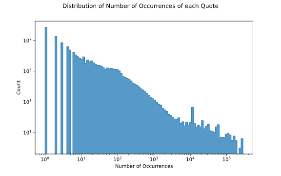
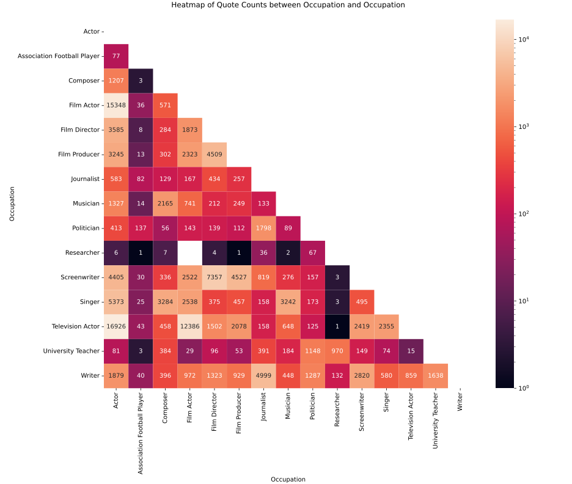

When working on a data science project, it is always important to thorougly visualize, explore and understand what is going on in the data. Even though the ultimate goal is to make models
do our job in our place, it is still very important to understand what we are feeding the model so that when problems arise we can link them to data.

## Extract data from the datasets
These little diagrams illustrate how we have used the two Datasets described in the <a href="{{site.url}}/introduction/"><b>Introduction</b></a> to extract the informations which we expected to be useful for our task.

## What is a viral quote?
We have, up until this point, used the adjective 'viral' for a quote, without ever defining it or explain why such a distinction can be made between quotes.

To do so, let's look at how the number or occurrences (which is the number of times a particular quote was found in different newspaper articles) is distributed across all quotes in the Quotebank dataset:

| Percentile | Min | 25.0% | 50.0% | 75.0% | 95.0% | 97.0% | 99.0% | 99.5% | 99.9% | Max    |
|------------|-----|-------|-------|-------|-------|-------|-------|-------|-------|--------|
| **Value**  | 1   | 1     | 1     | 2     | 10    | 17    | 55    | 90    | 215   | 282552 |

As you may already have noticed, more than half (63.3% to be precise) of quotes only appear in newspapers a single time! 79.2% of them appear strictly less than 3 times, and the number of quotes which are repeated more and more times decreases further and further, following what looks like a <a href="https://en.wikipedia.org/wiki/Power_law"><b>power law</b></a>. 

These observations justify why we may want to distinguish between quotes that have been cited multiple times, or more generally more than a certain number of times, and those that haven't. For the rest of the data story, we define viral quotes as those having been cited more than 100 times. Such quotes make up only 0.4% of our data.

## Who is speaking in our data?

Let's dive into the distributions of speaker informations across quotes in our dataset. Keep in mind that, in the following plots, each occurrence of each quote is counted as one measure (so a quote which was repeated many times will have a larger weight).

### How old are they?

 

Half of quotations in newspapers articles are from speakers aged between 19 and 66 years, which corresponds to what we would expect.

Let us, however, illustrate the importance of visualizing and analyzing the data before diving into any further analyses with an example: this dataset contains quotes from people more than 2000 years old (which have not been shown in the plot above). How is that possible? Very simply, the person being quoted is long dead and the quote is a proverb or a piece of a well-known literary work.

For the purposes of our analyses, we have no interest in keeping such quotes, and decided therefore to simply drop them.

### What gender?

 

76% of quotations in newspapers articles are from male speakers, followed by 23.9% quotations from female speakers and the remaining 0.1% from from people recognizing themselves as another gender. It is important to note this bias in our data at this stage as it may have an impact on later results. 

### What do they do for a living?

 

As we may expect, the majority of quotations in newspapers articles are attributed to politicians, sports related professions, artistic professions, ...

Let's look at the co-occurrence of different occupations for a single speaker:

As we can see from this matrix, some professions are labelled in multiple ways, such as actors, film actors, television actors, ... in the latter stages of our analysis we will take care to merge these similar occupations into a single label. Additionally, some occupations such as politician and lawyers, actors or businesspeople tend to often be assigned to the same person, whereas some others, such as researcher, often are the only ones assigned to a single speaker.

### Where do they come from?

 

The last information about the speakers that we want to focus on is their nationality. We have a little suspect that people from English-speaking countries may be cited more often in the English-speaking newspapers making up the Quotebank dataset. Indeed, this is confirmed by the plot above, where an overwhelming majority of quotes have speakers from either the United States of America, the United Kingdom, Australia or Canada.

## What is being said in our data?

Let's also have a look at the length, topics and expressed sentiments across quotes in our dataset. Once again, keep in mind that, in the following plots, each occurrence of each quote is counted as one measure (so a quote will be more important in our analysis).

### How long are the quotes?

|                          | min | 10% | 25% | 50% | 75% | 95% | max |
|--------------------------|-----|-----|-----|-----|-----|-----|-----|
| **Quote length (words)** | 1   | 7   | 11  | 19  | 31  | 58  | 483 |

Quote lengths in terms of number of words follow a heavy-tailed distribution, but 50% of quotes have lengths between 11 and 31 words, with the median placed at 19. Nonetheless, there are quotes which go up to almost 500 words, and others which are a single word (often simple exclamations such as 'AHHHHHH!' or 'Wow!').

For the rest of the analysis we shall define quotes as long if they have at least 31 words and short if they have less than 11 words. This yields the following distribution:

 

### Are the quotes expressing positive, negative or neutral opinions?

Sentiment analysis aims at identifying, given a particular sentence, if the opinion expressed in said sentence is rather positive, negative or neutral.

This problem has long been studied in the context of the English language (even though much less so for other languages), which from our perspective it means that powerful tools to extract the sentiment from a sentence are readily available. One such tools is [vaderSentiment](https://github.com/cjhutto/vaderSentiment), which we will use for our analyses.

We will group our quotes into three categories: those expressing positive sentiments, those expressing negative ones and the neutral quotes. Here is the distribution of these categories across our data:

 

As we can see, positive sentiments are preponderant in our data, which is, in our opinion, a surprise, but a welcomed one.

### What topics are they  talking about? 

In a similar fashion to sentiment analysis, topic detection is another discipline that in recent years has seen considerable advances. In the context of this work, we will use [BERTopic](https://github.com/MaartenGr/BERTopic) to extract from our corpus of quotes the most frequently occurring topics and the topics of newly observed quotes.

Illustrations of the topics we extracted from our data can be seen underneath. Please feel free to travel with your cursor on the different clusters and determine which topic is represented by each cluster. 

 

## The results of bertTopic : 
Here's a quick snapshot of the top topics from our dataset :

| Topic | Representative words                                                                                    |
|-------|---------------------------------------------------------------------------------------------------------|
| 0     | her, she, herself, hillary, clinton, lady, kim, sarah, actress, daughter                                |
| 1     | students, education, schools, teachers, classroom, teaching, educational, colleges, tuition, curriculum |
| 2     | defense, offense, plays, defensively, defensive, field, quarterback, players, turnovers, season         |
| 3     | music, songs, band, sing, singing, musicians, concert, albums, musician, singer                         |
| 4     | cricket, pitches, wickets, innings, wicket, batting, bowled, hitter, hitters, batsman                   |
| 5     | fight, boxing, fighter, fights, ufc, conor, fighters, heavyweight, boxer, punches                       |
| 6     | food, restaurant, restaurants, meal, meals, chef, foods, dishes, chefs, recipes                         |
| 7     | insurance, healthcare, obamacare, medicaid, doctors, hospitals, medicare, nurses, insurers              |
| 8     | league, liverpool, chelsea, arsenal, madrid, juventus, tottenham, everton, mourinho, napoli             |
| 9     | racing, laps, qualifying, ferrari, nascar, f1, raced, tyres, prix, motorsport                           |
| 10    | stock, investors, earnings, shareholders, markets, stocks, dividend, equity, shares, shareholder        |

### What we learn from the topics :
From the BerTopic model we have extracted the most relevant topics observed in the dataset. The most frequent topic contains female pronouns and names of the most relevant symbol of the female gender like Hillary Clinton. This is quite surprising since in the previous sections we have observed that female speakers are far less represented in the number of quotes with respect to male. One reason for why we may observe such a frequent topic may be due to the 2016 United States of America elections, which was certainly an event that was given huge media coverage, and one in which Donald Trump did not refrain from using Hilary Clinton's name in multiple occasions. The second most frequent topic can be labeled as education. This result can be expected since it also is a common discussion topic in politics. Other topics that appears to be also relevant in the newspaper are related to sports like American football, baseball, fighting sports, football, and racing. This result too can be explained with the information obtained in the previous sections, since we have observed that males of USA nationality that plays American football and males of UK nationality playing football represent a big portion of the total quotes.

If you want to see more analysis and conclusions from bertTopic, as well as more detailed mathematical explanations, don't hesitate to look at the github sourcecode!

 

As a last sanity check, instead of studying data piece by piece, we tried pairing them in what is called co-occurences matrixes. This allows us to be on the lookout for weird relations between data and think 2D instead of simply 1D : 
The male/female distribution over nations remains the same. We also notice that occupations are not quoted in the same proportions everywhere. American football players are more quoted in the American press, whilsts soccer players are more quoted in the UK press. In Russia and India there are close to no quotes on either. There are similar differences in occupations like actors, researchers etc... Another cool example is germany, where they seem much more inclined to quote researchers and research papers. 
Again, this reinforces the fact that our model will learn to think about popularity from an American based point of view, and might miss out on crucial factors if applied to other countries newspapers later on.

So even though we have used very basic tools, we can see how much information we extracted from the dataset and how much better we can understand if our model takes weird decisions and makes errors. Being a data scientist isn't only about being cool and using neural nets, it's also important to understand the base on which you build everything else! If you are interested in looking at more of our findings on data, don't hesitate to consult the comments in the source codes explaining more interesting relations and info extracted from our analysis. 

