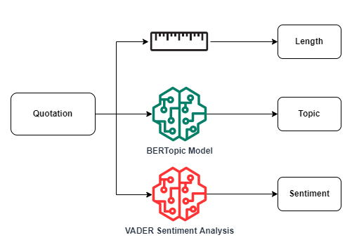

## What can we learn from a quote

After analysing how the characteristic of the different quoted speakers influences the virality of what they write, we are now corious to see if we can extract meaningfull informations directly from the quote itself.

    Exploratory data analysis can be done by hand parsing through data and generating statistical graphs (length of tweets, who said it, the date, the amount of citations…). 

Because of recent advances in computational techniques, a whole new field called NLP (Natural Language Processing) allows us to completely shift the analysis paradigm. This allows us to directly address the semantics of the quotes instead of trying to extract relevant information from mathematical features.
To achieve this on our dataset, we used two libraries : bertTopic and vaderSentiment.

The first information that we can extract from a quote is its length. By analysing all the quotes contined in the Quotebank dataset we can observe that observe that 50% of the quotes have a length smaller than 20 words and that 95% of the quotes have less than 60 words.

|              | Mean  | Std   | min | 10% | 25% | 50% | 75% | 95% | max |
|--------------|-------|-------|-----|-----|-----|-----|-----|-----|-----|
| Quote length | 24.06 | 19.23 | 1   | 7   | 11  | 19  | 31  | 58  | 483 |

## What we wanted from BertTopic and what we expected  :
To explain briefly without going into mathematical details, BertTopic allows us to group tweets into dense clusters defined around subjects. There are also very interesting visualisation tools packaged with the modelling technique. In our case, we expected the tool to give us clusters based on popular subjects in english newspapers (Trump, american football…), which would allow us to define more clearly what is popular and what isn’t in this kind of press.

## The results of bertTopic : 
=> show the topic split and comment on the fact that it just shows the basic distribution of newspaper stories (politics then sports with specifically american football then research breakthroughs etc)

| Topic | Representative words                                                                                    |
|-------|---------------------------------------------------------------------------------------------------------|
| 0     | her, she, herself, hillary, clinton, lady, kim, sarah, actress, daughter                                |
| 1     | students, education, schools, teachers, classroom, teaching, educational, colleges, tuition, curriculum |
| 2     | defense, offense, plays, defensively, defensive, field, quarterback, players, turnovers, season         |
| 3     | music, songs, band, sing, singing, musicians, concert, albums, musician, singer                         |
| 4     | cricket, pitches, wickets, innings, wicket, batting, bowled, hitter, hitters, batsman                   |
| 5     | fight, boxing, fighter, fights, ufc, conor, fighters, heavyweight, boxer, punches                       |
| 6     | food, restaurant, restaurants, meal, meals, chef, foods, dishes, chefs, recipes                         |
| 7     | insurance, healthcare, obamacare, medicaid, doctors, hospitals, medicare, nurses, insurers              |
| 8     | league, liverpool, chelsea, arsenal, madrid, juventus, tottenham, everton, mourinho, napoli             |
| 9     | racing, laps, qualifying, ferrari, nascar, f1, raced, tyres, prix, motorsport                           |
| 10    | stock, investors, earnings, shareholders, markets, stocks, dividend, equity, shares, shareholder        |

From the BerTopic model we have extracted the most relevant topics observed in the dataset. The most frequent topic contains female pronouns and names of the most relevant symbol of the female gender like Hillary Clinton. This is quite surprising since in the previous sections we have observed that female speakers are far less represented in the number of quotes with respect to male. One reason for why we may observe such a frequent topic may be due to the 2016 Unites States of America elections, which was certainly an event that was given huge media coverage, and one in which Donald Trump did not refrain from using Hilary Clinton's name in multiple occasions. The second most frequent topic can be labeled as education. This result can be expected since it also is a common discussion topic in politics. Other topics that appears to be also relevant in the newspaper are related to sports like American football, baseball, fighting sports, football, and racing. This result too can be explained with the information obtained in the previous sections, since we have observed that males of USA nationality that plays American football and males of UK nationality playing football represent a big portion of the total quotes.

## What we wanted from vaderSentiment and what we expected  :
Similarly to bertTopic, vaderSentiment’s main idea is to classify our quotes into sentiment based groups. The idea behind this is to see if we can find relevant information on how super popular quotes are structured. Are they mainly pessimistic or is it better for the quoter’s tone to be positive and optimistic, or it doesn’t actually matter, is one of the questions that we expect to be addressed by vaderSentiment.

## The results of vaderSentiment : 
Plots + comments 

 

 

 

 

 

 

 

 

