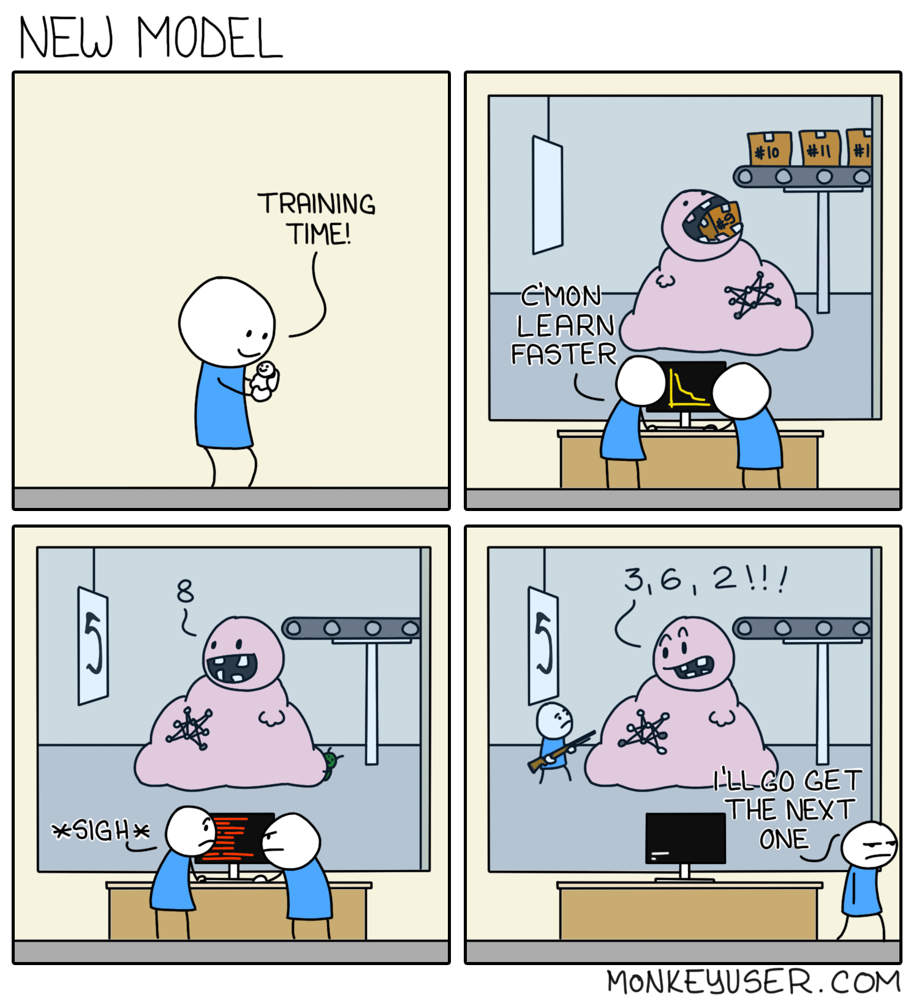

To predict the impact of each feature we extracted in the previous section on the number of times a quote is repeated, we trained multiple machine learning models.

## Machine learning
For the readers which are not particularly familiar with machine learning, here is a quick summary:

#### What is machine learning?
As [Wikipedia](https://en.wikipedia.org/wiki/Machine_learning) states it, machine learning is the study of computer algorithms that can improve automatically through experience and by the use of data.

#### Supervised learning
In this project, we will only use supervised learning: we give the machine learning models pairs of features and the corresponding desired outcomes, the models learn on their own some parameters, and then use those parameters to predict new outcomes from new features.

#### Features? Outcomes?
Features are, as we presented in the previous Section, some information that we can extract from our data. In our case it will be information about the speaker's age, occupation, nationality, gender, about the quote's length and topic and more.

Outcomes are what we want the model to predict from those features. In our case it will be a binary label (the quote is viral / the quote is not viral) or a number (the number of times we expect this quote to have been repeated).

### The Deadly Sin in Machine Learning
In machine learning, we are constantly faced with the problems of underfitting (the model's learning is incomplete) and overfitting (the model is learning something we do not want it to learn). You can read more about these issues [here](https://en.wikipedia.org/wiki/Overfitting). 

Both these situations are bad, and to avoid incurring into one of them without realizing, it is very important (and a deadly sin if you do not do it) to separate the data early into a training and a test set. This separation will allow to test if your model perfoms as well on completely unseen data as it does on the training data, or if it overfits/underfits the training data.

All this to say: we removed 30% of our available data and kept it aside with the aim of using it in the end to estimate if the models overfit or underfit. As our distribution of the number of occurrences is very skewed, we took special care in splitting the data such that the same proportion of very likely and very unlikely outcomes are present in the two splits.

For this same reason, when we wanted to estimate if the training of a model was progressing well (or we needed to manually adjust a couple parameters), we used 10-Folds Cross-Validation (you can read about it on [Wikipedia](https://en.wikipedia.org/wiki/Cross-validation_(statistics))).

## Predicting the number of occurrences

As we said previously, the idea is to find a relationship between our features and the number of times the quote was repeated.

### (Almost) Simplest regression model ever: Linear Regression

Linear regression finds a linear relationship between the features and the desired outcome.

The $$R^2$$ scores obtained over 10-Folds cross-validation with linear regression are summarized in this table:

| $$R^2$$ scores | Mean | Min | Max |
|---------------:|:----:|:---:|:---:|
|       Training |      |     |     |
|     Validation |      |     |     |

All you need to know about $$R^2$$ scores is that they are always $$\leq 1$$, where 1 would mean the model perfectly predicts the outcome from the features every time, 0 means the model always predicts the mean, and can go as low as $$-\infty$$ for models which do even worse than that.

As you may have noticed, our linear regressor is not much better than a model which simply predicts the mean. It is still nice to notice that the model is actually a little bit better than the baseline, as we have observed its maximum error never exceeds 180000 (which is, admittedly, a huge error) despite there being samples with outcomes as large as 240000.

#### So what can we conclude?
Unfortunately, nothing about what makes a quote be more likely to be repeated. Desite some results may be squeezed out of P-values and metrics for this model, it explains way too little of the variance in the data to justify our claims. 

Let me give you an exemple: imagine we claimed that our model shows being an actor (just an exemple!) makes you more likely to get quoted. Now imagine another researcher comes along and adds to our features a new magical one: is the speaker born in January? He trains again the model, and gets an $$R^2$$ very close to 1, with a negative impact of being an actor on the number of times you are quoted.
His model would explain much better what is happening in the data, and as such he would prove our claim wrong. All because we trusted a model which was trying its best, fighting tooth and nail to explain what was going on in the dataset with what we gave him and what it could do. Except, we did not give him the right tools, so he made a mistake.

#### Let's try more complex models
An analogy for what we did here is:

- Using linear regression: we had a painting brush, and a wall. We want somebody to paint the wall with the brush. We call our young nephew and pay him a few dollars for the wall. Quick, simple and sometimes effective solution. Except our nephew comes back and says there are holes the size of moon craters in our wall, and there's nothing he can to to fix that.
- Using complex models: we then call a professional carpenter and give it the same brush and the same wall, hoping he will be able to use a few tricks up his sleeve to repair at least partially the wall and give us something pretty.

How does our story end? The carpenter, in an attempt to repair the wall, not only did not do as good a job as our nephew which simply painted over the holes, but created even more damage. 

Indeed, we tried to use a Decision Tree to perform this regression task and despite our best efforts to avoid it underfitting or overfitting the training data, we obtained very negative validation $$R^2$$ scores back, which translates to significantly worse performance than our linear regressor.

# Illustrating our efforts...

## Predicting if a quote will be viral

Attempts done at predicting the binary label: "is the quote going to be repeated more than ??? times" have also failed in a similar fashion, with a linear model not performing much better than random guessing, and the decision tree performing even worse.

## So what can we conclude from our results?

Our results show a sad reality of machine learning and data analysis. Sometimes, it is just not possible to predict something with what you have. In our case, all these features which we extracted, despite having reasons to believe that they would individually all explain some difference in quotability, do not in fact appear to do so.

It may be that we chose features which are not useful by themselves, or that there is simply too much noise in this data, in the form of external phenomenons not tracked by this data such as trends, real-life events, ... which would need to be accounted for to obtain meaningful results.

The first issue can be solved by trying out even more complex models (deep learning models) capable of extracting more features from the initial ones all by themselves, and then use these new features to predict the outcome. We did not explore these models here because we were interested in interpreting the results obtained, which is an horribly hard task with such complex models. 

In the end, what we can conclude is: our features do not allow us, with the models we tried, to explain the effects we observe in the data, and there must be factors that we did not (and potentially could not) account for which have a very large impact on the number of times a quote is repeated in newspapers.
