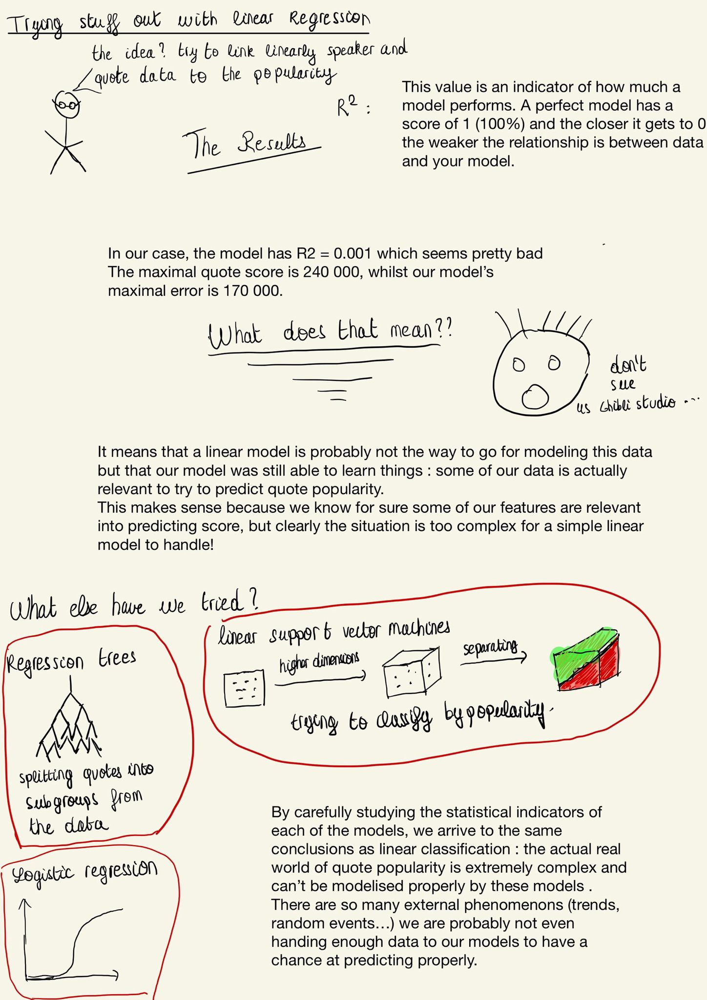

   
## Predicting the virality

The data we want to study is huge even for computers. To predict virality using what we call a model, it is necessary to train the model on all the data because it is extremely varied. This means that we have to choose models that do not take too much time to train, excluding us from taking more complicated models from artificial intelligence.
The models used for the research are linear regression (a mathematical model for finding linear links between popularity and the speaker's data/chosen topics) and classification (projecting the data into a plane of multiple dimensions and separating them into popular/non popular quotes).

Now let's check out the results and see if we find anything satisfying from our two models.

